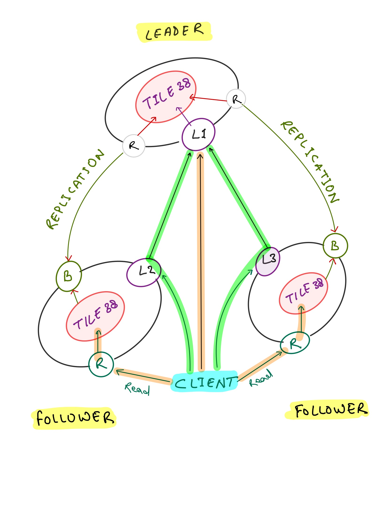

# Manager

Tile38 Cluster Manager is a sidecar utility to help deploy a distributed, dynamic [Tile38][] cluster inside Consul Connect network mesh.

The cluster manager runs as a proxy alongside a Tile38 database and provides following features:

 - Clustering with leader election
 - Data replication from active leader
 - Handling node failures and promoting a follower
 - Authorization and network traffic encryption using Consul Connect

## Install

Pre-built binaries are available from [releases][] page. Alternatively, you can install the manager using `go get` or pull the docker image.

Using `go get`

```sh
go get -u github.com/Shuttl-Tech/tile38-cluster-manager
```

[releases]: https://github.com/Shuttl-Tech/tile38-cluster-manager/releases

## Deployment Model

!!! note "Opinions are reserved"
    The cluster manager makes some assumptions about the deployment model. Specifically, it assumes that the service is deployed in a Connect mesh, and service discovery is provided by Consul catalog.

The manager expects to run inside Consul Connect network mesh, and all the traffic to and from the main Tile38 process is proxied through the manager.

Each manager process provides two services - The leader, and the follower. Both of these services must be registered in Consul Catalog for the manager to function properly. Optionally, the manager itself can also register the services in consul catalog if so needed.

A manager process listens on three network interfaces.

 - Writer (`W`) - Accepts connections from clients and proxies to Tile38
 - Reader (`R`) - Accepts connections from clients and proxies to Tile38
 - Replication Bridge (`B`) - Accepts connections from Tile38 and proxies to active leader

At any point in time, only one manager process can be the leader, all other instances become followers and replicate data from the active leader. The leader node is responsible for write operations, and the followers are responsible for read operations.

The writer and reader listeners correspond to the leader and follower services registered in consul catalog. Both of these listeners are active and listening all the times, but how they proxy the network traffic changes based on the role of the instance.

When the manager is in `Leader` role, the `reader` listener (`R`) proxies the traffic to other available instances, and the `writer` listener (`W`) proxies to the underlying Tile38 listener.

When the manager is in `Follower` role, the `reader` listener (`R`) proxies the traffic to the underlying Tile38 listener, and the `writer` listener (`W`) proxies to the active leader.

The replication bridge `B` is active only when the manager is in follower role, and always proxies to the `reader` interface of the active leader.

Following diagram shows the writes operations on a cluster of 3 nodes.



Note that a client can write to any of the available nodes, more specifically, to `L1`, `L2` or `L3`, but the writes are always handled by the leader node, either directly or via proxy from `L2` and `L3`.

Also, note that the reads are handled by followers directly. The diagram does not show it, but the reads from leader are proxied to a random follower, similar to writes.

A service which intends to consume Tile38 should rely on Consul based service discovery and connect to either `leader` or the `follower` service depending on whether it wants to perform writes or read operations.


!!! caution "Manager is Connect Native"
    Note that the manager runs in [Connect Native][] mode, so a Connect sidecar proxy is neither required nor expected. The client is expected to make a direct connection with the manager.  
    
    Every listener exposed by the manager expects mTLS authorization with a certificate issued by Connect CA.
    

## Clustering and Failover

The managers uses Consul KV lock based leadership election mechanism. A manager process becomes the leader if it is able to acquire the lock, otherwise it becomes a follower. Depending on the role, the manager executes appropriate commands on its underlying Tile38 instance to start or stop data replication.

If the leadership lock is released for any reason, all active manager processes perform the same series of actions once again and converge on a reliable state with a new leader.


## Deployment

When deploying with a scheduler that manages the service in consul catalog, keep in mind that the catalog service definition requires a `meta` attribute `id` that must be set to the same unique ID of the instance as configured with `--id` command line flag or `SERVICE_ID` environment variable. This meta attribute is used in service discovery to find the real network address of the active leader. When running with `--service.manage` flag, the manager takes care to correctly register the services in consul catalog.

When deploying with Nomad, the following jobspec can be used as a reference:

??? note "Jobspec"
    ```
    job "tile38-cluster" {
      update {
        max_parallel      = 3
        canary            = 3
      }
      
      group "cluster" {
        count = 2
        
        network {
          mode = "bridge"
          port "tile38" {
            to = "9851"
          }

          port "leader" {
            to = "-1"
          }

          port "follower" {
            to = "-1"
          }
        }

        service {
          name = "tile38-reader"
          port = "follower"
          task = "manager"

          connect {
            native = true
          }

          check {
            name           = "Tile38 Follower Listener"
            initial_status = "warning"
            type           = "tcp"
            port           = "follower"
          }

          meta {
            id = "${NOMAD_ALLOC_ID}"
          }
        }

        service {
          name = "tile38-writer"
          port = "leader"
          task = "manager"

          connect {
            native = true
          }

          check {
            name           = "Tile38 Writer Listener"
            initial_status = "warning"
            type           = "tcp"
            port           = "leader"
          }

          meta {
            id = "${NOMAD_ALLOC_ID}"
          }
        }

        task "server" {
          leader = true
          driver = "docker"
          config {
            image = "tile38/tile38:latest"
          }
        }

        task "manager" {
          driver = "docker"
          config {
            image = "tile38-cluster-manager:latest"
          }

          env {
            # Set the unique ID to the allocation ID
            SERVICE_ID  = "${NOMAD_ALLOC_ID}"
            
            # Advertise the IP of the host
            ADVERTISE   = "${attr.unique.network.ip-address}"
            
            # ... other configuration
          }
        }
      }
    }
    ```

----

{!flags.txt!}

[Connect Native]: https://www.consul.io/docs/connect/native
[Tile38]: https://github.com/tidwall/tile38